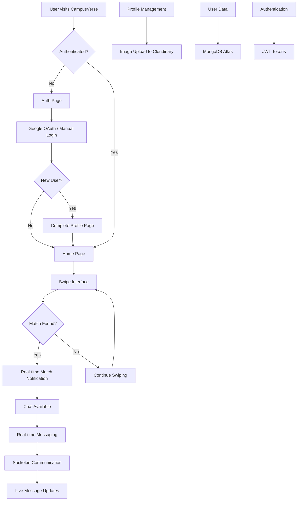

# 🌟 CampusVerse - College Social Platform

**🚀 [LIVE DEMO](https://campusverse.onrender.com)** ⭐ **[GitHub Repository Branch](https://github.com/im47ak/swipe-tinder_clone/tree/feature/gauth)** ⭐ **[GitHub Repository](https://github.com/im47ak/swipe-tinder_clone)**

A modern, full-stack social networking application designed specifically for college students, featuring real-time messaging, smart connections, and seamless Google OAuth integration. Built with **React**, **Node.js**, **MongoDB**, and **Socket.io**.

> **🎯 Complete MERN Stack project showcasing full-stack development skills for placement interviews!**

---

## 🚀 Complete Feature Set

### 🔐 **Authentication & Security**
- **Google OAuth Integration** - Secure single sign-on for @cmrit.ac.in email addresses
- **Domain-based Access Control** - Restricted to college students only
- **JWT Token Authentication** - Secure session management
- **Protected Routes** - Role-based access control

### 👥 **Social Networking Features**
- **Smart Profile System** - Complete profile creation with preferences and photo uploads
- **Connection Algorithm** - Intelligent matching based on preferences and interests
- **Swipe Interface** - Intuitive card-based interaction system
- **Real-time Matching** - Instant connection notifications

### 💬 **Real-time Communication**
- **Live Chat System** - Instant messaging with Socket.io
- **Real-time Notifications** - Live unread message counts and alerts
- **Auto-scroll Chat** - Smooth user experience with automatic message scrolling
- **Connection Status** - Online/offline indicators

### 🎨 **User Experience**
- **Responsive Design** - Mobile-first approach, works on all devices
- **Modern UI/UX** - Clean, intuitive interface with smooth animations
- **Professional Branding** - Consistent design language throughout
- **Error Handling** - Comprehensive user feedback and error management

### ☁️ **Cloud Integration**
- **Image Upload** - Cloudinary integration for profile photos
- **Production Deployment** - Live application hosted on Render
- **Database Management** - MongoDB Atlas for data persistence
- **Environment Security** - Secure configuration management

---

## 🛠️ Tech Stack & Architecture

### **Frontend Technologies**
- **React 18** - Modern component-based UI library with hooks
- **Vite** - Fast build tool and development server
- **TailwindCSS** - Utility-first CSS framework for rapid styling
- **DaisyUI** - Component library for consistent design system
- **Zustand** - Lightweight state management for React applications
- **React Router DOM** - Client-side routing for single-page application
- **Socket.io Client** - Real-time bidirectional communication
- **React OAuth Google** - Google authentication integration
- **React Tinder Card** - Smooth swipe animations and gestures

### **Backend Technologies**
- **Node.js** - JavaScript runtime for server-side development
- **Express.js** - Web application framework for building RESTful APIs
- **MongoDB** - NoSQL document database for flexible data storage
- **Mongoose** - MongoDB object modeling for Node.js
- **Socket.io Server** - Real-time WebSocket communication server
- **JWT (jsonwebtoken)** - Secure token-based authentication
- **bcryptjs** - Password hashing for security
- **Cloudinary** - Cloud-based image and video management

### **DevOps & Infrastructure**
- **Render** - Cloud platform for application deployment
- **MongoDB Atlas** - Cloud database service
- **Google Cloud Console** - OAuth 2.0 configuration
- **Environment Variables** - Secure configuration management
- **CORS** - Cross-origin resource sharing configuration

---

## 🏆 Technical Achievements

### **Full-Stack Development**
- **Complete MERN Implementation** - End-to-end application development
- **RESTful API Design** - Well-structured backend with proper HTTP methods
- **Database Design** - Efficient MongoDB schema with relationships
- **Component Architecture** - Reusable and maintainable React components

### **Real-time Systems**
- **WebSocket Integration** - Bidirectional communication for live features
- **Event-driven Architecture** - Efficient real-time updates
- **Connection Management** - Proper socket connection handling and cleanup
- **Live State Synchronization** - Real-time UI updates across users

### **Authentication & Security**
- **OAuth 2.0 Implementation** - Industry-standard authentication
- **Domain Restriction** - College-specific access control
- **JWT Security** - Secure token management with expiration
- **Environment-based Configuration** - Secure production deployment

### **Modern Development Practices**
- **State Management** - Centralized application state with Zustand
- **Responsive Design** - Mobile-first approach with CSS Grid/Flexbox
- **Error Handling** - Comprehensive error management and user feedback
- **Code Organization** - Clean architecture with separation of concerns

---

## 💼 For Placement Interviews

### 🎯 **Key Talking Points**
- **"Built a complete full-stack social platform using the MERN stack"**
- **"Implemented real-time communication using WebSocket technology"**
- **"Integrated OAuth 2.0 authentication with domain-based access control"**
- **"Deployed to production with proper environment and security management"**
- **"Used modern development practices and industry-standard tools"**

### 📊 **Technical Complexity Demonstration**
- **Backend**: RESTful APIs, JWT authentication, Socket.io server, MongoDB operations
- **Frontend**: React hooks, state management, real-time UI updates, responsive design
- **DevOps**: Environment configuration, build optimization, cloud deployment

---

## 🏗️ Detailed Project Structure

```
campusverse/
├── api/                           # Backend Server (Node.js + Express)
│   ├── controllers/               # Business logic handlers
│   │   ├── authController.js      # Authentication & OAuth logic
│   │   ├── userController.js      # User profile management
│   │   ├── matchController.js     # Matching algorithm & logic
│   │   └── messageController.js   # Chat messaging system
│   │
│   ├── models/                    # MongoDB Schema Definitions
│   │   ├── User.js               # User profile & preferences
│   │   └── Message.js            # Chat message structure
│   │
│   ├── routes/                    # API Route Definitions
│   │   ├── authRoutes.js         # Authentication endpoints
│   │   ├── userRoutes.js         # User management endpoints
│   │   ├── matchRoutes.js        # Matching system endpoints
│   │   └── messageRoutes.js      # Messaging endpoints
│   │
│   ├── middleware/                # Custom Middleware
│   │   └── auth.js               # JWT token verification
│   │
│   ├── socket/                    # Real-time Communication
│   │   └── socket.server.js      # Socket.io server configuration
│   │
│   ├── config/                    # Configuration Files
│   │   ├── db.js                 # MongoDB connection setup
│   │   └── cloudinary.js         # Image upload configuration
│   │
│   ├── seeds/                     # Database Seeding
│   │   └── user.js               # Sample user data
│   │
│   └── server.js                  # Main server entry point
│
├── client/                        # Frontend Application (React + Vite)
│   ├── src/
│   │   ├── components/            # Reusable UI Components
│   │   │   ├── Header.jsx         # Navigation header
│   │   │   ├── Sidebar.jsx        # Chat sidebar with matches
│   │   │   ├── SwipeArea.jsx      # Card swiping interface
│   │   │   ├── SwipeFeedback.jsx  # Swipe animations & feedback
│   │   │   ├── MessageInput.jsx   # Chat message input
│   │   │   ├── LoginForm.jsx      # Traditional login form
│   │   │   ├── SignUpForm.jsx     # User registration form
│   │   │   └── GoogleSignInButton.jsx # OAuth button component
│   │   │
│   │   ├── pages/                 # Main Page Components
│   │   │   ├── HomePage.jsx       # Main swiping interface
│   │   │   ├── AuthPage.jsx       # Login/signup page
│   │   │   ├── ProfilePage.jsx    # User profile management
│   │   │   ├── ChatPage.jsx       # Individual chat interface
│   │   │   └── CompleteProfilePage.jsx # OAuth profile completion
│   │   │
│   │   ├── store/                 # State Management (Zustand)
│   │   │   ├── useAuthStore.js    # Authentication state
│   │   │   ├── useUserStore.js    # User profile state
│   │   │   ├── useMatchStore.js   # Matching & swiping state
│   │   │   └── useMessageStore.js # Chat messaging state
│   │   │
│   │   ├── socket/                # Client-side Socket Configuration
│   │   │   └── socket.client.js   # Socket.io client setup
│   │   │
│   │   ├── lib/                   # Utility Libraries
│   │   │   └── axios.js           # HTTP client configuration
│   │   │
│   │   ├── App.jsx                # Main application component
│   │   ├── main.jsx               # React application entry point
│   │   └── index.css              # Global styles
│   │
│   ├── public/                    # Static Assets
│   │   ├── female/                # Sample female profile images
│   │   ├── male/                  # Sample male profile images
│   │   ├── avatar.png             # Default avatar image
│   │   └── vite.svg               # Vite logo
│   │
│   ├── index.html                 # HTML template
│   ├── package.json               # Frontend dependencies
│   ├── vite.config.js             # Vite build configuration
│   ├── tailwind.config.js         # TailwindCSS configuration
│   └── postcss.config.js          # PostCSS configuration
│
├── .env                           # Backend environment variables
├── .gitignore                     # Git ignore patterns
├── package.json                   # Backend dependencies & scripts
└── README.md                      # Project documentation
```

---

## 🔄 Application Flow & Architecture



---

## 🚦 Getting Started & Installation

### **Prerequisites**
- Node.js (v18 or higher)
- MongoDB Atlas account
- Google OAuth 2.0 credentials
- Cloudinary account for image uploads

### **Local Development Setup**

1. **Clone & Install**
   ```bash
   git clone https://github.com/im47ak/swipe-tinder_clone.git
   cd campusverse
   
   # Install backend dependencies
   npm install
   
   # Install frontend dependencies
   cd client && npm install
   ```

2. **Environment Configuration**
   
   **Backend (.env)**
   ```env
   PORT=5000
   MONGO_URI=your_mongodb_atlas_connection_string
   JWT_SECRET=your_secure_jwt_secret
   CLOUDINARY_CLOUD_NAME=your_cloudinary_cloud_name
   CLOUDINARY_API_KEY=your_cloudinary_api_key
   CLOUDINARY_API_SECRET=your_cloudinary_api_secret
   GOOGLE_CLIENT_ID=your_google_oauth_client_id
   CLIENT_URL=http://localhost:5173
   NODE_ENV=development
   ```
   
   **Frontend (client/.env)**
   ```env
   VITE_GOOGLE_CLIENT_ID=your_google_oauth_client_id
   ```

3. **Start Development Servers**
   ```bash
   # Backend server (from root directory)
   npm run dev
   
   # Frontend server (in new terminal)
   cd client && npm run dev
   ```

4. **Access Application**
   - **Local Frontend**: http://localhost:5173
   - **Local Backend API**: http://localhost:5000
   - **Live Production**: https://campusverse.onrender.com

---

## 📱 Key Components & State Management

### **Authentication Flow**
```javascript
// useAuthStore.js - Authentication state management
- signup() - User registration with validation
- login() - Traditional email/password login
- googleAuth() - OAuth 2.0 Google sign-in
- checkAuth() - Session validation
- logout() - Secure session termination
```

### **Real-time Communication**
```javascript
// useMessageStore.js - Chat state management
- sendMessage() - Send message via Socket.io
- subscribeToMessages() - Listen for real-time messages
- getMessages() - Fetch chat history
- updateUnreadCount() - Live notification updates
```

### **Social Features**
```javascript
// useMatchStore.js - Matching system state
- getMatches() - Fetch user matches
- swipeLeft() - Reject connection
- swipeRight() - Create potential match
- getUserProfiles() - Get swipeable profiles
```

### **Profile Management**
```javascript
// useUserStore.js - User profile state
- updateProfile() - Edit user information
- uploadImage() - Cloudinary image upload
- setPreferences() - Update matching preferences
```

---

**🏆 Built with passion for connecting college communities and showcasing modern web development skills**

> **Ready for placement interviews!** This project demonstrates comprehensive full-stack development, real-time systems, authentication, cloud deployment, and modern development practices.
